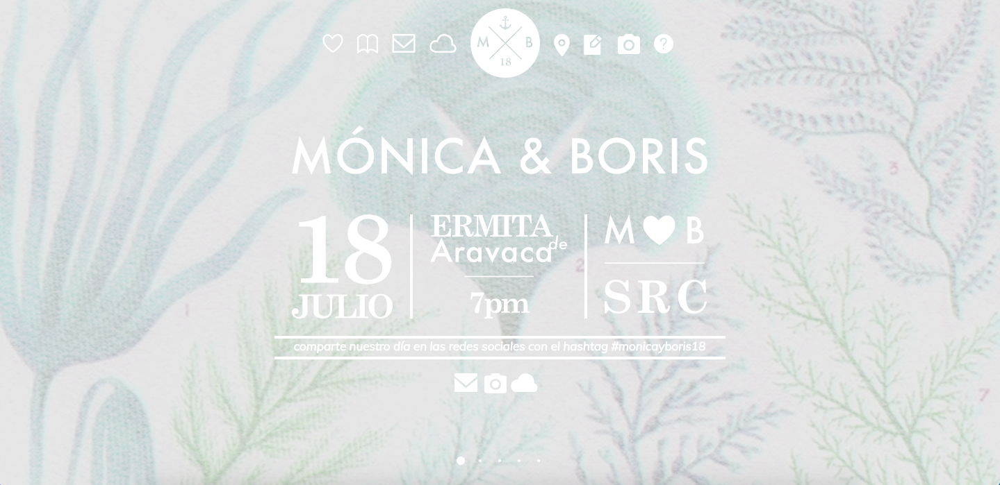
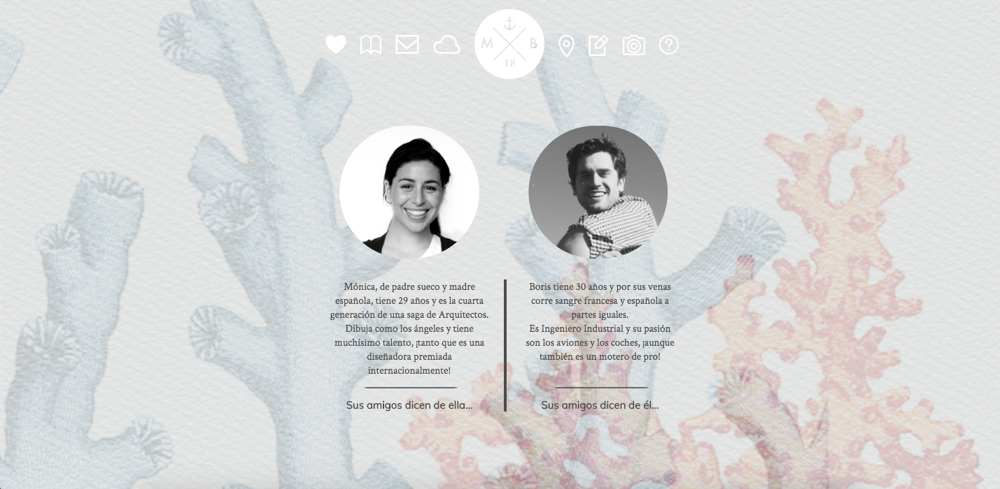
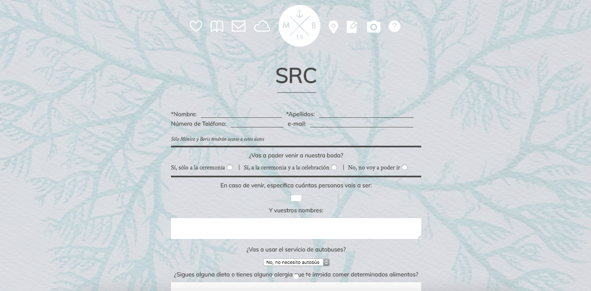

# Another web for a friend's wedding.

This is a personal project from 2014. I wanted to create a website for a couple of good friends that were getting married in 2015. The idea was that the guests could have all the information on the site, with directions to both the church and the reception, the wedding list, and some other features like a guest book, a section where friends could add their thoughts on bride and/or groom, and RSVP.
I still did not know much about making websites, so I had to figure out how to add the comments section and the RSVP form, both working with PHP. Since I did not have time to figure out how to automatically show comments on the website itself, I used a rather rudimentary alternative: the comments would be sent to my inbox via PHP and I would add them as I received them. The RSVP was sent to the bride and groom's own e-mail account. It also had an instagram gallery using a third party script (which apparently no longer works) that showed public photos tagged with their own hashtag.
I designed the whole thing, including the graphics. This was the second option I presented my friends with and they loved it. 
I also put a lot of time an effort on this project though not so much as with [the first option](https://github.com/marianalfr/monica-y-boris). This time around I used a basic javascript single page template I found online.

### Technologies

* HTML.
* CSS.
* Third-party javascript scripts.

### MIT License.

Copyright (c) 2019 Mariana Lerma.

Permission is hereby granted, free of charge, to any person obtaining a copy
of this software and associated documentation files (the "Software"), to deal
in the Software without restriction, including without limitation the rights
to use, copy, modify, merge, publish, distribute, sublicense, and/or sell
copies of the Software, and to permit persons to whom the Software is
furnished to do so, subject to the following conditions:

The above copyright notice and this permission notice shall be included in all
copies or substantial portions of the Software.

THE SOFTWARE IS PROVIDED "AS IS", WITHOUT WARRANTY OF ANY KIND, EXPRESS OR
IMPLIED, INCLUDING BUT NOT LIMITED TO THE WARRANTIES OF MERCHANTABILITY,
FITNESS FOR A PARTICULAR PURPOSE AND NONINFRINGEMENT. IN NO EVENT SHALL THE
AUTHORS OR COPYRIGHT HOLDERS BE LIABLE FOR ANY CLAIM, DAMAGES OR OTHER
LIABILITY, WHETHER IN AN ACTION OF CONTRACT, TORT OR OTHERWISE, ARISING FROM,
OUT OF OR IN CONNECTION WITH THE SOFTWARE OR THE USE OR OTHER DEALINGS IN THE
SOFTWARE.
